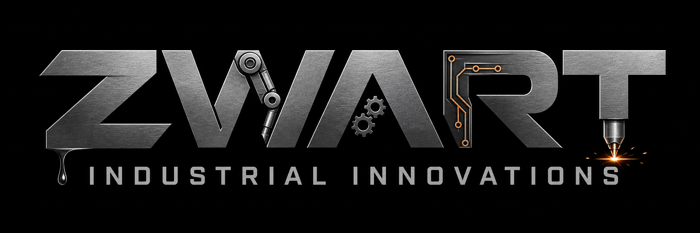

  

  <h1>Zwart Industrial Innovations</h1>

  
<strong>Practical ideas. Engineered for industry.</strong>

  

    Industrial technology | Engineering | Prototyping | Innovation
  

---

## &#9881; Built for industry

*Practical innovation, shaped by engineering.*

Zwart Industrial Innovations turns technical ideas into practical solutions. We focus on clear engineering, useful experimentation, and technology that works beyond the prototype.

This GitHub profile is the home of our public projects, technical experiments, tools, and documentation.

## &#128269; Inside our workshop

*Explore what we build, test, and share.*

- **Projects** - practical software and engineering work
- **Prototypes** - concepts developed through testing and iteration
- **Tools** - reusable utilities that support technical workflows
- **Documentation** - notes and guidance for using and understanding our work

## &#128736; How we engineer

*From a clear purpose to a dependable result.*

We value solutions that are:

- Purposeful and grounded in a real need
- Clear enough to understand and maintain
- Robust enough to use in practice
- Improved through testing, feedback, and iteration

## &#128640; Featured work

*Ideas in motion. Technology in practice.*

Take a look at the pinned repositories below for a selection of current and featured projects. Each active repository contains its own documentation, setup instructions, and contribution guidelines.

## &#129309; Let's build something

*Questions, ideas, or an opportunity to collaborate?*

Have a question about one of our projects or see an opportunity to collaborate?

- Open an issue in the relevant repository for project-specific questions
- Use the contact details listed on our GitHub profile for general enquiries

---

  Zwart Industrial Innovations

